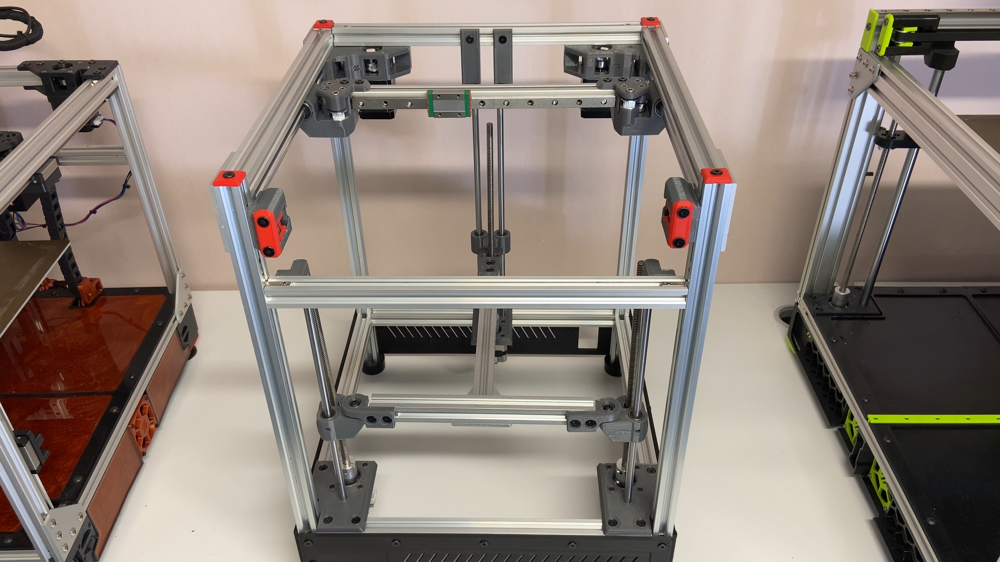
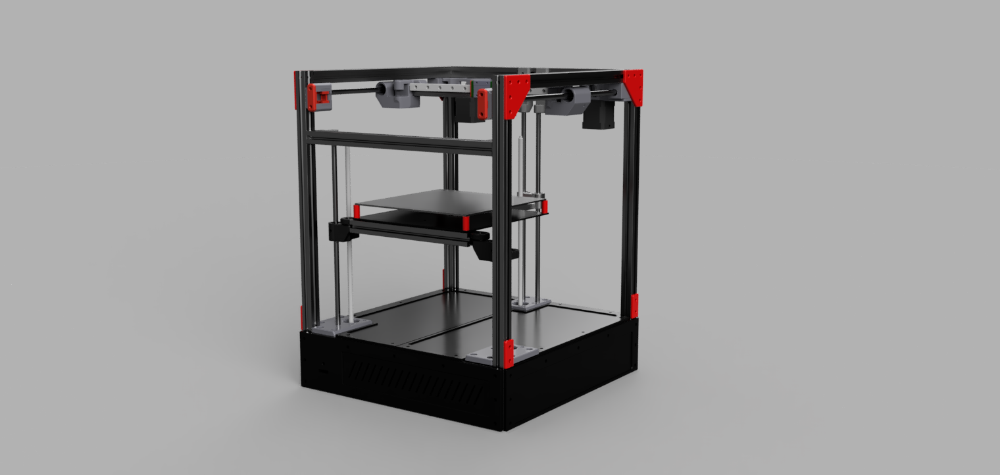

# The NN DIY 3D printer

> [!NOTE]
> This is still a prototype!

## Some key information the build:

- Build plate 220 x 220 
- 2020 extrusions 
- 1x SKR Pico and 1x SKR 1.4 controller boards (not critical, use whatever you have that have enough drivers and can run Klipper)
- Radxa Rock 3C SBC (or a Pi. SBC with 3-4 USB ports recommended)
- MGN 12H rails/carriage X
- 10mm rods and bearings on Y 
- 8mm rods and bearings on Z 
- Corexy
- Klipper firmware 
- Triple z steppermotors
- Sensorless homing on X and Y 
- Dragonburner with Sherpa micro and CPAP
- 1 x 240W 24V power supply

### Cutting extrusions

- 4x2020 500mm for Z 
- 8x2020 350mm for X and Y

### extrusions for bed assy 220x220
- 1x2020 240mm center 
- 1x2020 220mm front 

>[!TIP]
>Check the frame for squareness and adjust/correct  as needed.
>Mount the 3 z-motor mounts with M5 10mm bolts. The motor mounts makes the frame more rigid. Check the frame again for squareness.

# Video part 1
https://youtu.be/kZbBAxifQg0

